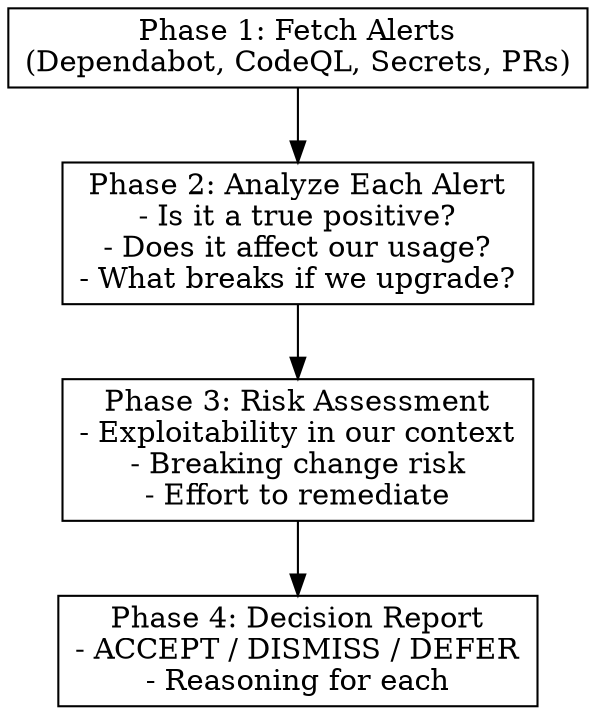

# GitHub Security Operations Assessment

Fetches security alerts, analyzes their validity and impact, and produces an actionable assessment for decision-making.

## Workflow



## Phase 1 — Fetch OPEN Alerts Only

### Dependabot Alerts (open only)
```bash
gh api repos/{owner}/{repo}/dependabot/alerts --paginate -q '[.[] | select(.state == "open")]' 2>/dev/null || echo "[]"
```

### CodeQL Alerts (open only)
```bash
gh api repos/{owner}/{repo}/code-scanning/alerts --paginate -q '[.[] | select(.state == "open")]' 2>/dev/null || echo "[]"
```

### Secret Scanning (open only)
```bash
gh api repos/{owner}/{repo}/secret-scanning/alerts --paginate -q '[.[] | select(.state == "open")]' 2>/dev/null || echo "[]"
```

### Security PRs (open only)
```bash
gh pr list --search "security OR dependabot OR codeql OR vulnerability OR CVE" \
  --state open --limit 10 --json number,title,author,createdAt,url
```

**Skip dismissed/closed/resolved alerts entirely.** Only surface what needs action.

## Phase 2 — Analyze Each Open Alert

For each alert, answer three questions:

1. **Reachable?** — Is the vulnerable code actually used?
   ```bash
   grep -r "import.*{package}\|from.*{package}" --include="*.py" .
   ```

2. **Applicable?** — Does the CVE match our context? (OS, config, usage pattern)

3. **Upgrade safe?** — Breaking changes in the fix?

## Phase 3 — Decision

| Decision | When |
|----------|------|
| **ACCEPT** | Vuln applies, fix is safe |
| **DISMISS** | Vuln doesn't apply (wrong OS, unused code path, etc.) |
| **DEFER** | Applies but low risk, or fix has breaking changes |

## Phase 4 — Generate Concise Assessment

**Keep it brief. Only show what needs action.**

```markdown
## Security Assessment: {repo}

| Open Alerts | Count |
|-------------|-------|
| Dependabot | N |
| CodeQL | N |
| Secrets | N |
| PRs | N |

---

### Alert #{number}: {package} ({severity})

**CVE:** {cve_id} | **Fix:** {patched_version}

**Applicable?** YES/NO — {one sentence why}

**Recommendation:** ACCEPT / DISMISS / DEFER

{If ACCEPT: upgrade command}
{If DISMISS: dismissal reason + command}

---

### Action Summary

| Alert | Decision | Reason |
|-------|----------|--------|
| #N | ACCEPT/DISMISS/DEFER | brief reason |

{Dismissal commands if any}
```

**Report rules:**
- No history of dismissed alerts
- No closed PRs
- One paragraph max per alert
- Show commands ready to copy-paste

## Dismissal Commands

When dismissing alerts with user approval:

```bash
# Dismiss Dependabot alert
gh api -X PATCH repos/{owner}/{repo}/dependabot/alerts/{number} \
  -f state=dismissed \
  -f dismissed_reason="{not_used|inaccurate|tolerable_risk}" \
  -f dismissed_comment="{explanation}"

# Dismiss CodeQL alert
gh api -X PATCH repos/{owner}/{repo}/code-scanning/alerts/{number} \
  -f state=dismissed \
  -f dismissed_reason="{false_positive|wont_fix|used_in_tests}"

# Dismiss Secret Scanning alert
gh api -X PATCH repos/{owner}/{repo}/secret-scanning/alerts/{number} \
  -f state=resolved \
  -f resolution="{false_positive|wont_fix|revoked|used_in_tests}"
```

## Common Dismissal Reasons

| Pattern | Reason | Example |
|---------|--------|---------|
| Windows-only vuln on Linux project | `not_used` | "TORtopus is Ubuntu-only" |
| Dev dependency not in prod | `tolerable_risk` | "Only used in test fixtures" |
| Debug mode vuln, we run production | `not_used` | "We run with debug=False" |
| Already mitigated by other control | `tolerable_risk` | "Behind auth, not public" |
| False positive in scanner | `inaccurate` | "Scanner misidentified usage" |

## Notes

- Always verify before dismissing - read the actual CVE
- Consider defense-in-depth even for "not applicable" vulns
- Document dismissals for audit trail
- Re-evaluate dismissed alerts periodically
- If unsure, default to DEFER not DISMISS
